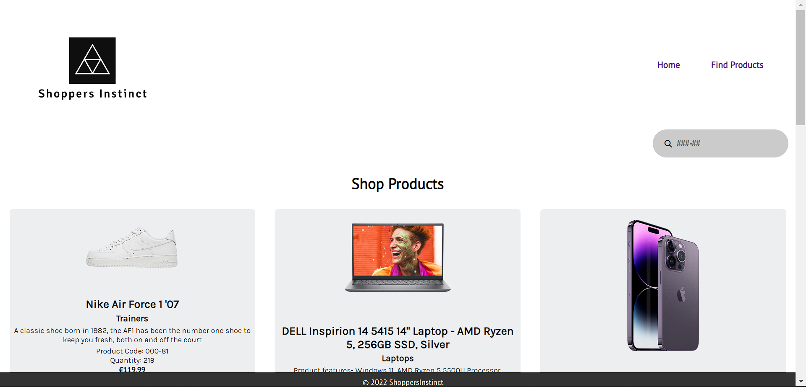

#### ShoppersInstinct is a place where consumers can buy their loved items all in one place.

Tech used:

HTML/CSS/JavaScript/XSD/XML/XSLT
	
> ####	Here are the lists of taks done during this project:
>	- Used XML to hold the data
>	- Used XSLT to transform the data and the display it
>	- Created search bar as a filter search using JS
>	- Used JavaScript to make the search bar funtion and added error message when no products were displayed
>	- Styled the product cards
>	- Created a footer
>	- Added Images to product cards using xsl if statements
>	- Added basic information to home page

#### Desktop view: 

#### Mobile View: 

